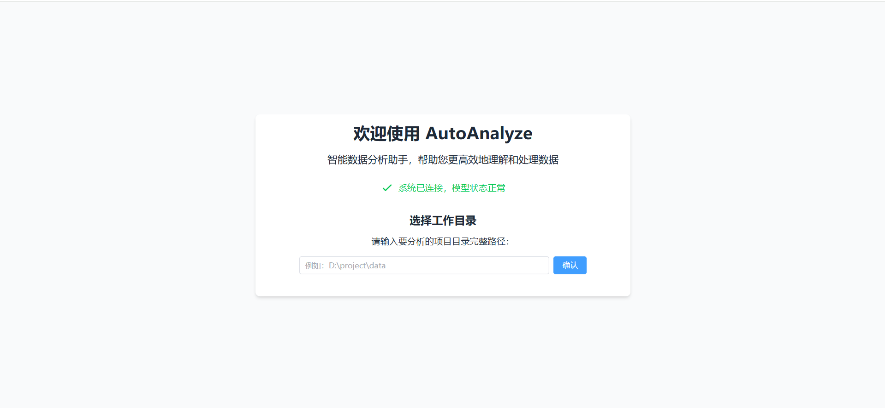
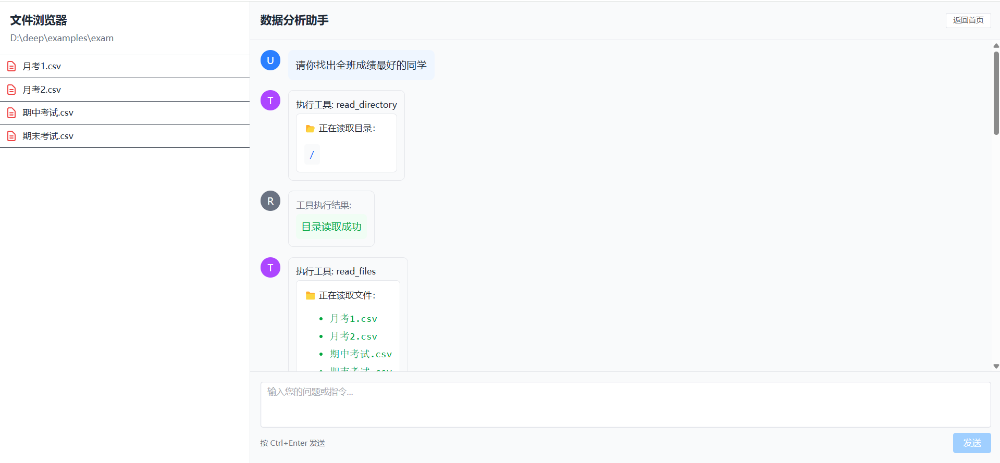

## 简介

[English Version available here](https://github.com/wangyafu/AutoAnalyze/blob/master/README_EN.md)

AutoAnalyze是一个让AI为你进行数据分析和处理的工具。你需要输入数据所在文件夹的路径，然后向AI用自然语言描述你的需求，然后AI就会根据你的需求读取文件、编写python代码并执行。你可以看到AI对工具的调用情况.


> 目前项目已经完成了基本功能，我正在继续更新以增强程序的健壮性。

### Demo




### 视频演示

[B站演示视频](https://www.bilibili.com/video/BV1idXyYZEFY/)

## 功能亮点

- 通过自然语言描述需求，AI会自动编写Python代码并执行
- 你可以实时看到AI对工具的调用情况
- 自定义使用的大模型
- 支持显示图像输出
- 支持配置视觉模型，使AI能够理解它生成的图像（目前仅会对展示出的图像使用）

## 安装

```shell
git clone https://github.com/wangyafu/AutoAnalyze
cd AutoAnalyze
```

## 快速开始

本项目采用前后端分离架构，前端使用Vue.js，后端使用FastAPI。因此你需要分别启动前后端服务。

在使用本项目之前，你需要确保已经具有Node.js和Python环境。另外本项目采用[uv](https://docs.astral.sh/uv/)作为Python环境的依赖管理工具。你需要确保已经安装了uv。

### 启动前端

```shell
cd frontend
npm install
npm run dev
```

### 启动后端

```shell
cd backend
uv sync
uv run app/main.py
```

### 注册IPython内核

为了实现图像输出、实时显示代码输出、取消代码执行等功能，本项目在v0.02版本中引入了jupyter_client库连接IPython内核。如果你希望直接使用上一步中安装的Python解释器，你可以在backend路径下输入以下命令:

```shell
# Linux/macOS
source .venv/bin/activate

# Windows
.venv\Scripts\activate.bat  # cmd
.venv\Scripts\Activate.ps1  # PowerShell

where python #应该包括一个在本项目的安装地址下的路径

python -m ipykernel install --user #将本项目所用的python解释器注册为IPython内核
```

### 开始体验

完成以上工作后，打开浏览器，访问http://localhost:5173 ，开始体验用AI帮助你进行数据分析的魅力！

## 双智能体模式
该模式还在测试中。在该模式下将引入用户代理智能体，该智能体将负责制定计划。这样做的好处是:
1. 使用不支持Function Call功能的大模型，用户代理智能体不直接调用工具，而是指导工具调用智能体完成任务。

2. 通过智能体间的协作完成较为复杂的任务。

但当前双智能体模式实现较为简陋，可能无法提高任务的完成率。
## 配置大模型

你可以通过修改backend/config.yaml文件来配置大模型。也可以在前端的设置页面中配置。

目前本项目兼容OpenAI API的大模型，同时工具调用大模型必须支持Function Call功能。

我本人使用过的大模型是qwen-plus、qwen-max、deepseek-chat(deepseek-v3)。


## 额外说明
- 主页如果显示“后端服务:连接失败”，说明后端服务没有启动或启动失败。
- 主页如果显示“后端服务:连接成功 模型状态异常”，说明后端服务启动成功，但模型无法正常使用。(后端会发送一个到你指定的endPoint下/models端点的请求，请求失败则认为模型无法使用)
- 正常情况下，主页会显示“后端服务:连接成功 模型状态正常”。
- 默认情况下，后端服务默认端口号为8000,前端服务默认端口号为5173。如果你要在其他的端口上运行服务，你需要在backend/config.yaml和前端界面上完成相应修改。
- 本项目绝大部分代码由DeepSeek-R1和Claude完成，logo则由Gemini 2.0 Flash Experimental生成。感谢这些AI让我可以在几天内就完成这个项目的雏形。
