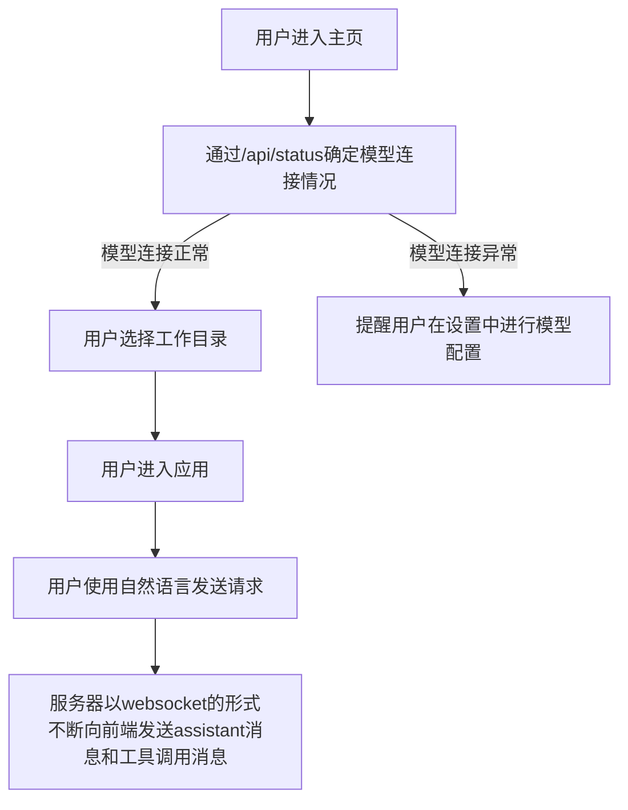

d:\deep\frontend_app\
├── public\                      # 静态资源目录
│   ├── favicon.ico              # 网站图标
│   └── logo.png                 # 应用logo
├── src\                         # 源代码目录
│   ├── assets\                  # 资源文件
│   │   ├── images\              # 图片资源
│   │   │   └── logo.svg         # 应用logo SVG版本
│   │   └── styles\              # 样式文件
│   │       ├── main.css         # 主样式文件
│   ├── components\              # 组件目录
│   │   ├── common\              # 通用组件
│   │   │   ├── AppHeader.vue    # 应用头部组件
│   │   │   ├── AppSidebar.vue   # 侧边栏组件
│   │   │   └── AppFooter.vue    # 底部组件
│   │   ├── chat\                # 聊天相关组件
│   │   │   ├── ChatInput.vue    # 聊天输入框
│   │   │   ├── ChatMessage.vue  # 聊天消息组件
│   │   │   ├── ChatHistory.vue  # 聊天历史记录
│   │   │   └── CodeBlock.vue    # 代码块显示组件，对应type=tool_invocation_start且function=exec_code的websocket消息的code字段，注意除了显示代码外，还要在接受到相应tool_invocation_result消息后，显示相应执行结果
│   │   ├── file\                # 文件相关组件
│   │   │   ├── FileExplorer.vue # 文件浏览器，展示工作目录下的文件情况
│   │   │   ├── FilePreview.vue  # 文件预览组件
│   ├── views\                   # 页面视图
│   │   ├── HomeView.vue         # 首页，用户进入应用时展示的界面，点明应用的功能并提醒用户选择工作目录
│   │   ├── WorkspaceView.vue    # 工作区页面，用户在此查看工作目录的文件情并和ai进行对话。采用双栏结构。左侧栏展示文件情况，右侧为会话界面
│   │   ├── SettingsView.vue     # 设置页面，用户可以在此更新用户设置，如模型的api_key等。
│   │   └── NotFoundView.vue     # 404页面
│   ├── router\                  # 路由配置
│   │   └── index.ts             # 路由定义
│   ├── stores\                  # Pinia状态管理
│   │   ├── workspace.ts         # 工作区状态，主要是工作目录下的文件信息
│   │   ├── conversation.ts      # 对话状态，存储当前对话的消息和状态
│   │   ├── settings.ts          # 设置状态
│   │   └── index.ts             # 状态管理入口
│   ├── services\                # 服务层
│   │   ├── api.ts               # API调用封装
│   │   ├── websocket.ts         # WebSocket服务
│   │   └── fileSystem.ts        # 文件系统服务
│   ├── utils\                   # 工具函数
│   │   ├── formatters.ts        # 格式化工具
│   │   └── markdown.ts          #使用markdown-it渲染markdown文本
│   ├── types\                   # TypeScript类型定义
│   │   ├── api.ts               # API相关类型
│   │   ├── conversation.ts      # 对话相关类型
│   │   └── file.ts              # 文件相关类型
│   ├── App.vue                  # 应用根组件
│   ├── main.ts                  # 应用入口文件
│   └── env.d.ts                 # 环境变量类型声明
├── index.html                   # HTML入口文件
├── package.json                 # 项目依赖配置
├── postcss.config.js            # PostCSS配置
├── tailwind.config.js           # Tailwind CSS配置
├── tsconfig.json                # TypeScript配置
├── vite.config.ts               # Vite构建配置
└── README.md                    # 项目说明文档

## 注意事项
- 使用tailwind编写样式
- 使用element-ui中的ElMessage、ElNotification等通知类的组件

## 前端流程图
